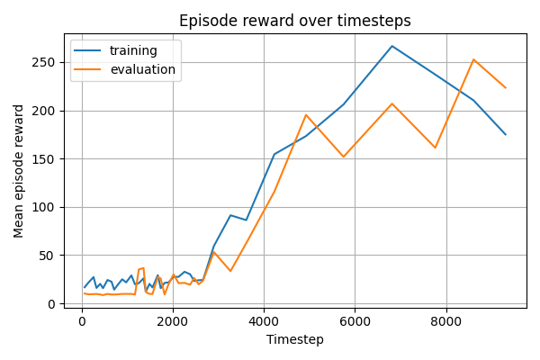

# Deep Q-Networks

This project implements a framework for training Deep Q-Networks with enhancements such as **Double DQN**, **Dueling DQN**, and **Lazy Frame Stacking**. The core Deep Q-Learning implementation is based on the paper ["Playing Atari with Deep Reinforcement Learning"](http://arxiv.org/abs/1312.5602) by Mnih et al. (2013).

### Example usage: Cart Pole

[Source code](src/dqn/examples/cartpole.py)


```
----------------------------------
| rollout/            |          |
|   ep_len_mean       |  175.00  |
|   ep_rew_mean       |  175.00  |
| stats/              |          |
|   episodes          |  160     |
|   fps               |  325     |
|   total_timesteps   |  9304    |
------------------------------------------
|   best_model_reward       |  252.60    |
|   model_updates           |  8304      |
|   exploration_rate        |  0.01      |
|   replay_buffer_size      |  0.22   MB |
|   replay_buffer_filled    |  93.55 %  |
------------------------------------------
|   elapsed                 | 00:00:29   |
|   done                    |  93.04 %   |
|   est_remaining           | 00:00:02   |
------------------------------------------
----------------------------------
| Training finished!             |
----------------------------------
|   best_eval_reward  |  252.60  |
|   training_time     | 00:00:32 |
----------------------------------
```

### Install package
```
pip install git https://github.com/brtkkndrl/DQN.git
```

### Example training script:
```
dqn_example_cartpole
```

### Development
```
python -m venv venv
source venv/bin/activate
pip install -e .[examples]
```
